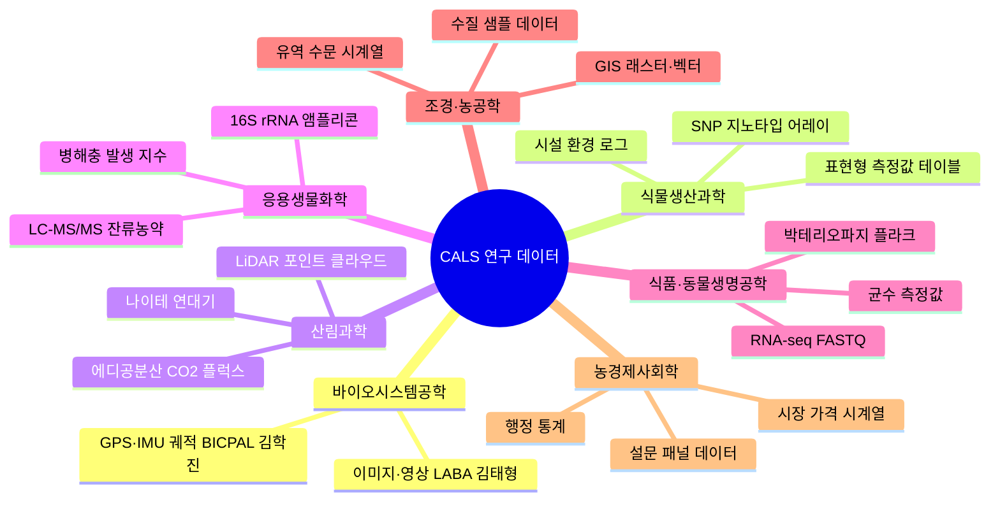
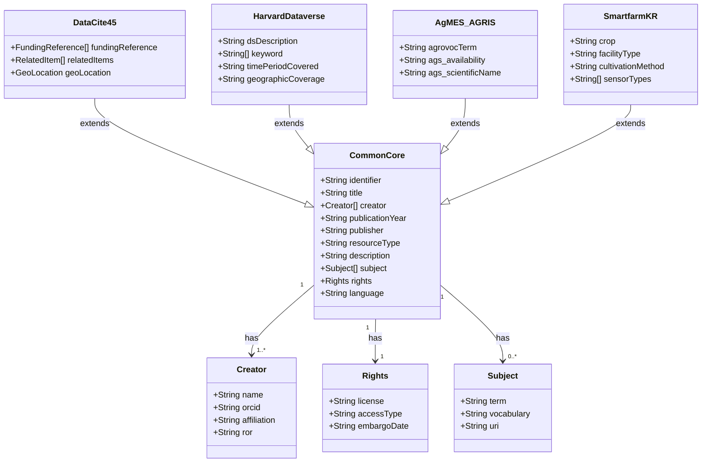
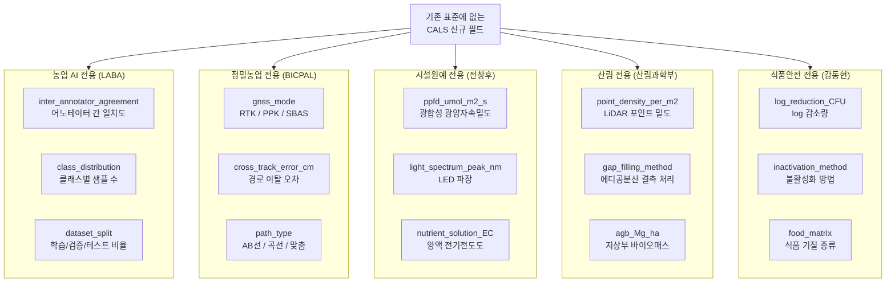
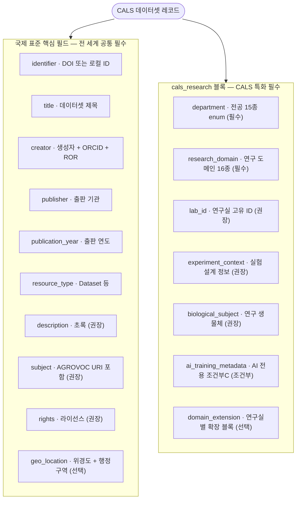
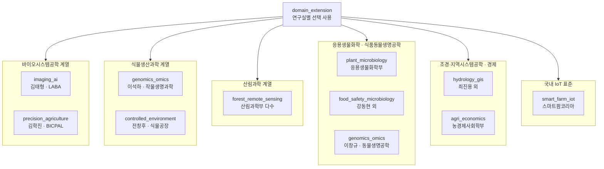
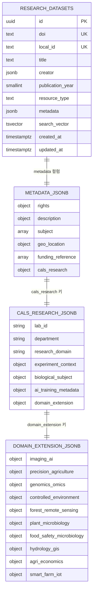
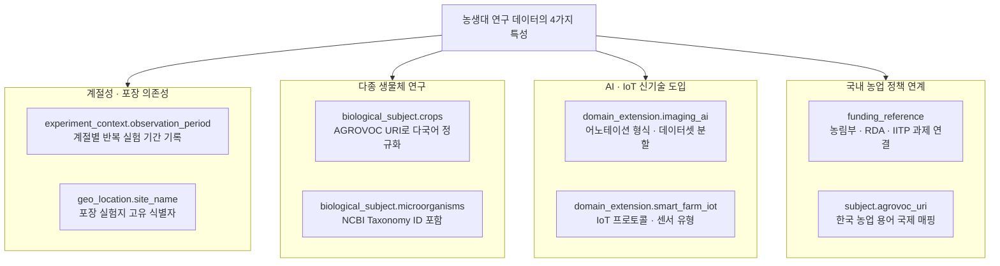
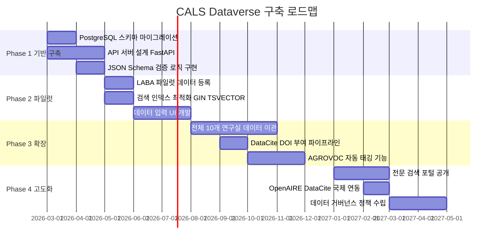
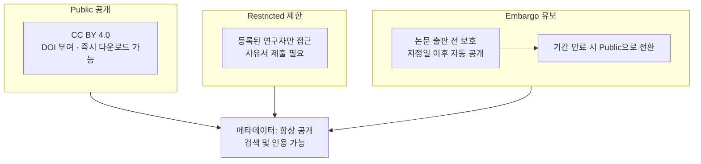
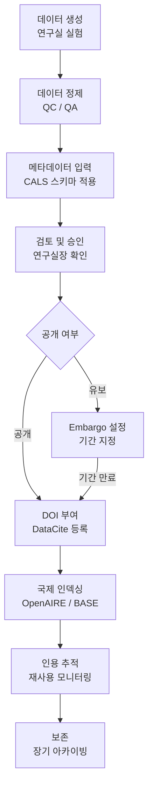

# CALS 데이터 메타데이터 표준 설계 보고서

> **문서 정보**
> - 작성일: 2026-02-25
> - 버전: v2.0 (구조 오류 수정 + 핵심 블록 설명 보강)
> - 대상 시스템: 서울대학교 농업생명과학대학(CALS) 연구 데이터 통합관리 플랫폼 (CALS Dataverse)
> - 참조 파일: `standards/*.json` (7종), `standards/snu_cals_labs.json`, `schema/cals_metadata_schema.json`

---

## 목차

1. [데이터 구조 정의의 선행 필요성](#섹션-1-데이터-구조-정의의-선행-필요성)
2. [글로벌 메타데이터 표준 분석](#섹션-2-글로벌-메타데이터-표준-분석)
3. [CALS 내부 연구 데이터 역설계](#섹션-3-cals-내부-연구-데이터-역설계)
4. [통합 CALS 메타데이터 스키마 제안](#섹션-4-통합-cals-메타데이터-스키마-제안)
5. [설계 근거 및 농생대 특화 적용점](#섹션-5-설계-근거-및-농생대-특화-적용점)
6. [향후 로드맵](#섹션-6-향후-로드맵)
7. [부록: 용어 설명](#부록-용어-설명)

---

## 섹션 1: 데이터 구조 정의의 선행 필요성

### 1.1 데이터버스(Dataverse)란 무엇인가?

**데이터버스**는 연구 데이터를 공개·공유·보존하기 위한 **온라인 저장소(Repository)** 플랫폼입니다. 논문이 학술지에 실리듯, 연구 과정에서 수집한 원본 데이터셋 자체를 독립적으로 출판(publish)하고 DOI(디지털 객체 식별자)를 부여하는 시스템입니다.

예를 들어, 김태형 교수님(LABA 연구실)의 육계(브로일러) 밀도 추정 AI 모델을 훈련한 이미지 데이터셋이 있다면, 이를 논문에 첨부하는 것이 아니라 **독립된 데이터 패키지**로 등록하여 다른 연구자들이 재사용할 수 있게 만드는 것이 데이터버스의 핵심입니다.

### 1.2 왜 DB 구축 전에 메타데이터 스키마를 먼저 정의해야 하는가?

> "도서관을 짓기 전에 서가 분류 기준을 먼저 정해야 한다."

데이터베이스(DB)는 단순한 데이터 저장소가 아닙니다. **"무엇을, 어떻게 기록하는가"** 라는 기준이 없으면, 데이터가 쌓일수록 검색이 불가능해지고 시스템은 실질적으로 무용지물이 됩니다.

| 단계 | 선행 설계 없이 구축 시 | 메타데이터 표준 선행 설계 후 구축 시 |
|------|----------------------|--------------------------------------|
| 데이터 입력 | 연구실마다 제각각 형식 | 통일된 필드셋으로 일관성 확보 |
| 데이터 검색 | "딸기" 검색 불가 (일부는 "strawberry", 일부는 "딸기") | AGROVOC 통제어휘로 정규화하여 통합 검색 가능 |
| 데이터 재사용 | 어떤 기기로, 어떤 조건에서 수집했는지 알 수 없음 | 기기 모델·수집 조건 필드 표준화로 재현 가능 |
| 국제 연동 | 국내에서만 사용 가능 | DataCite 등 국제 표준과 연결되어 글로벌 검색 가능 |
| 확장 | 새 연구실 추가 시 DB 구조 전체 변경 필요 | JSONB 기반으로 새 필드를 기존 DB 변경 없이 추가 가능 |

### 1.3 농생대 데이터의 '비정형성' 문제

농생대(CALS)는 **7개 학부, 15개 이상 전공**으로 구성되어 있으며, 각 연구실이 다루는 데이터 종류가 극단적으로 다릅니다.



이미지 데이터에는 `annotation_type` 필드가 필요하지만 경제학 설문에는 전혀 필요 없습니다. 반대로 설문에는 `n_respondents` 필드가 필요하지만 LiDAR 데이터에는 무의미합니다. **하나의 고정된 테이블 구조로 저장하는 것은 불가능**합니다.

### 1.4 해결책: '유연한 스키마 (Flexible Schema)'

이 문제를 해결하는 기술적 해답이 **PostgreSQL의 JSONB 데이터 타입**입니다.

- **국제 표준 핵심 필드**: 제목·생성자·날짜·식별자 등 전 세계 공통 → 고정 컬럼으로 저장
- **cals_research 블록**: CALS 연구 데이터 고유 정보 → JSONB 컬럼에 계층형 구조로 저장

```sql
-- PostgreSQL 테이블 구조 예시
CREATE TABLE research_datasets (
    id               UUID PRIMARY KEY,
    doi              TEXT UNIQUE,
    title            TEXT NOT NULL,      -- 국제 표준 핵심 필드 (고정 컬럼)
    creator          JSONB NOT NULL,     -- 국제 표준 핵심 필드 (복합 구조)
    publication_year SMALLINT NOT NULL,  -- 국제 표준 핵심 필드 (고정 컬럼)
    metadata         JSONB NOT NULL      -- cals_research + 선택 확장 필드 (유연)
);
```

이 구조를 사용하면 **새로운 연구실이 추가되거나 새로운 데이터 유형이 생겨도**, 기존 DB 테이블을 변경하지 않고 `metadata` JSONB 안에 새 필드를 추가하는 것만으로 대응할 수 있습니다.

---

## 섹션 2: 글로벌 메타데이터 표준 분석 (International Benchmarking)

### 2.1 조사 개요

CALS 메타데이터 스키마 설계에 앞서, 국내외 주요 연구 데이터 저장소 및 농업 분야 메타데이터 표준 **7종**을 벤치마킹하였습니다.

| # | 표준명 | 운영 기관 | 파일 | 특징 |
|---|--------|-----------|------|------|
| 1 | **DataCite Metadata Schema 4.5** | DataCite e.V. (국제) | `datacite_4_5.json` | 연구 데이터 DOI 부여의 사실상 국제 표준. M/R/O 3단계 의무 체계. |
| 2 | **Harvard Dataverse (DDI 2.5)** | Harvard IQSS | `harvard_dataverse.json` | Citation·Geospatial·Social Science 블록 분리. 생명과학 확장 포함. |
| 3 | **Dublin Core DCMI Terms** | DCMI | `dublin_core.json` | 15개 핵심 요소의 최소 공통 어휘. 모든 표준의 기반. |
| 4 | **AGRIS AP 2.0 + AgMES 1.1** | FAO | `agmes_agris_fao.json` | 농업 특화 요소, AGROVOC 통제어휘 연계. |
| 5 | **AI 허브 데이터셋 메타데이터** | NIA (한국) | `aihub_kr.json` | AI 학습용 데이터셋 국내 표준. 845종+ 공개 데이터 카탈로그 기반. |
| 6 | **스마트팜코리아 데이터 마트** | 농림축산식품부 | `smartfarm_kr.json` | 시설원예 IoT 센서 데이터 포맷. 환경·제어·생육·이미지 5개 카테고리. |
| 7 | **Wageningen WUR Yoda** | Wageningen University | `wageningen_wur.json` | 세계 최상위 농업연구대학 DataCite 기반 메타데이터. NARCIS 학문 분류. |

### 2.2 표준별 심층 분석

#### DataCite 4.5 — "국제 연구 데이터 신분증"

DataCite는 연구 데이터에 **DOI(Digital Object Identifier)** 를 부여하는 국제 비영리 컨소시엄입니다. DOI는 데이터셋의 영구 주소로, 논문의 URL이 바뀌어도 DOI는 항상 같은 데이터를 가리킵니다.

DataCite 4.5는 **20개 속성(Property)** 으로 구성되며, 의무 수준을 3단계로 구분합니다.

- **M (Mandatory)**: 반드시 제공 — `Identifier`, `Creator`, `Title`, `Publisher`, `PublicationYear`, `ResourceType`
- **R (Recommended)**: 강력 권장 — `Subject`, `Contributor`, `Date`, `Description`, `Rights`, `FundingReference`
- **O (Optional)**: 선택적 — `Language`, `AlternateIdentifier`, `RelatedItem` 등

CALS 스키마는 DataCite 4.5의 **M 필드 6개를 최상위 필수 요소로 채택**하였습니다.

#### Harvard Dataverse — "생명과학 연구 데이터의 황금 기준"

Harvard IQSS에서 운영하는 Dataverse는 전 세계 연구 데이터 저장소의 사실상 표준 플랫폼입니다. 메타데이터를 **블록(Block)** 단위로 분리하여 유연성을 확보합니다.

- `citation` 블록: 인용 기본 정보
- `geospatial` 블록: 지리정보 (위경도, 행정구역)
- `socialscience` 블록: 사회과학 연구 설계
- `biomedical` 블록: 생명과학 확장

이 블록 분리 개념이 CALS 스키마의 **`domain_extension` 블록** 설계에 직접 영향을 주었습니다.

#### AGRIS AP / AgMES — "농업 분야 언어 표준"

FAO(유엔 식량농업기구)가 개발한 **AGROVOC(농업 통제어휘 시소러스)** 는 40개 언어로 제공되는 농업 분야 용어 체계입니다. `crop=딸기`와 `crop=strawberry`를 동일한 AGROVOC URI(`http://aims.fao.org/aos/agrovoc/c_7394`)로 정규화함으로써 언어 장벽 없이 국제 검색이 가능해집니다.

AgMES는 공식적으로 deprecated 상태이나, AGROVOC 연계를 위한 참조 표준으로 활용하였습니다.

#### 스마트팜코리아 — "국내 농업 IoT 현장 표준"

농림축산식품부의 스마트팜 데이터 마트는 시설원예 현장에서 실제 수집되는 IoT 센서 데이터의 실용적 형식을 보여줍니다.

```json
{
  "환경": { "온도": 24.5, "습도": 68, "CO2": 850, "광량": 12000 },
  "제어": { "난방기": "ON", "창문개폐율": 30 },
  "생육": { "엽수": 12, "초장": 45.2 },
  "이미지": { "촬영시각": "2026-02-25T09:00:00Z", "카메라ID": "CAM_01" }
}
```

이 구조는 전창후 교수님(식물공장·시설원예 연구실)의 `controlled_environment` 도메인 확장 블록 설계에 반영되었습니다.

### 2.3 핵심 공통 필드 (Common Fields) 클래스 다이어그램

7개 표준 모두에 공통으로 등장하는 핵심 필드를 분석한 결과입니다.



> `Creator.orcid` = 연구자 식별자 / `Creator.ror` = 기관 식별자 / `Subject.vocabulary` = AGROVOC 등 통제어휘명 / `Rights.license` = CC BY 4.0 등

### 2.4 표준 간 비교 매트릭스

| 기능 | DataCite 4.5 | Harvard DV | Dublin Core | AGRIS/AgMES | AI 허브 | 스마트팜 | WUR Yoda |
|------|:---:|:---:|:---:|:---:|:---:|:---:|:---:|
| DOI 부여 기반 | ✅ | ✅ | ❌ | ❌ | ❌ | ❌ | ✅ |
| 농업 특화 어휘 | ❌ | △ | ❌ | ✅ | △ | ✅ | △ |
| AI/이미지 데이터 지원 | △ | △ | ❌ | ❌ | ✅ | △ | ❌ |
| IoT 센서 포맷 | ❌ | ❌ | ❌ | ❌ | ❌ | ✅ | ❌ |
| 국제 상호운용성 | ✅ | ✅ | ✅ | ✅ | ❌ | ❌ | ✅ |
| 국내 규정 준수 | △ | ❌ | △ | △ | ✅ | ✅ | ❌ |
| 생명과학 확장 | △ | ✅ | ❌ | ✅ | ❌ | ❌ | ✅ |

> ✅ 완전 지원 / △ 부분 지원 / ❌ 미지원

**결론**: 어떤 단일 표준도 CALS의 모든 요구사항을 충족하지 못합니다. **다표준 통합 접근(Multi-Standard Integration)** 이 필요합니다.

---

## 섹션 3: CALS 내부 연구 데이터 역설계 (Lab-Specific Analysis)

### 3.1 연구 방법론

각 연구실의 데이터 구조를 파악하기 위해 **논문의 재료 및 방법(Materials & Methods, M&M) 섹션 역설계** 방법을 사용하였습니다. 실험을 재현하는 데 필요한 정보가 M&M에 집약되어 있기 때문입니다.

```
논문 M&M 섹션 분석 → 수집된 데이터 유형 파악 → 메타데이터 필드 도출 → JSON 스키마 정의
```

조사된 연구실: **7개 학부, 10개 연구실** (대표 연구실 기준)

### 3.2 연구실별 데이터 특성 요약

#### 🔬 바이오시스템공학전공

**① LABA 연구실 — 김태형 교수 (Vision AI · 정밀축산)**

> `lab_id: snu_bse_laba` | `http://laba.snu.ac.kr`

LABA는 농업 분야에 딥러닝·컴퓨터비전을 적용하는 연구실로, CALS 데이터버스에서 가장 복잡한 데이터 구조를 요구합니다.

| 데이터 유형 | 특징 | 대표 필드 |
|------------|------|-----------|
| 이미지 / 영상 | 축사 CCTV, UAV 항공 촬영 | `camera_model`, `resolution`, `fps` |
| 포인트 클라우드 | 작물 3D 형상 데이터 | `scanner_model`, `point_density` |
| AI 어노테이션 | COCO JSON 형식 바운딩 박스 | `annotation_type`, `n_annotators`, `iaa_score` |
| 데이터셋 분할 | 학습/검증/테스트 비율 | `train_ratio`, `val_ratio`, `test_ratio` |

- 대표 논문: *An innovative segment anything model for precision poultry monitoring* (DOI: 10.1016/j.compag.2024.004368)
- **핵심 역설계 필드**: `inter_annotator_agreement` (어노테이터 간 일치도), `class_distribution` (클래스별 샘플 수), `model_reference` (사용 모델명)

이 연구실의 데이터는 기존 어떤 국제 표준에서도 다루지 않는 **농업 AI 데이터셋** 유형으로, CALS 스키마의 `imaging_ai` 도메인 블록과 `ai_training_metadata` 조건부 블록이 신규 설계된 배경입니다.

---

**② BICPAL 연구실 — 김학진 교수 (정밀농업 · GPS/GNSS)**

> `lab_id: snu_bse_bicpal`

트랙터·농업용 로봇의 자율주행을 위한 GPS/IMU 센서 융합 데이터.

- 핵심 필드: `gnss_receiver`, `gnss_mode` (RTK/PPK/SBAS), `position_accuracy_cm`, `cross_track_error`
- 대표 논문: *Development of a low-cost GPS/INS integrated system for tractor automation* (DOI: 10.25165/j.ijabe.20161003.2107)

---

#### 🌾 식물생산과학부

**③ 작물생명과학전공 — 이석하 교수 외 (유전체 · GWAS)**

> `lab_id: snu_plant_crop_science`

콩, 벼, 밀 등의 게놈 와이드 연관분석(GWAS) 및 QTL 매핑.

```json
{
  "genotyping": {
    "platform": "Illumina SoySNP180K BeadChip",
    "n_markers": 180961,
    "reference_genome": "Gmax_Wm82.a2.v1"
  },
  "phenotyping": {
    "traits": ["days_to_flowering", "plant_height_cm", "seed_protein_pct"],
    "field_design": "RCBD",
    "n_replicates": 3
  }
}
```

- 대표 논문: *Genome-wide association studies reveal novel QTLs for agronomic traits in soybean* (DOI: 10.3389/fpls.2024.1375646)

---

**④ 식물공장·시설원예 — 전창후 교수 (LED 광질 · 수확 후 관리)**

> `lab_id: snu_plant_horticulture`

LED 광원 처리에 따른 작물 생육 반응 및 수확 후 품질 데이터.

- 핵심 필드: `ppfd` (광합성 광양자 속밀도), `light_spectrum_peak_nm` (파장), `photoperiod` (명/암 주기), `nutrient_solution_EC`
- 대표 논문: *Improvement of strawberry transplant production efficiency by supplemental blue light* (DOI: 10.1007/s13580-022-00493-9)

---

#### 🌳 산림과학부

**⑤ 산림원격탐사·탄소순환 연구실 (산림과학부 다수 교수)**

> `lab_id: snu_forest_lidar_carbon`

LiDAR 포인트 클라우드, 에디공분산 CO₂ 플럭스, 나이테 연대기를 동시에 다루는 복합 데이터 구조.

| 데이터 유형 | 필드 예시 | 규모 |
|------------|----------|------|
| LiDAR | `scanner_model`, `point_density_per_m2`, `las_version` | 수 GB/ha |
| 에디공분산 | `tower_height_m`, `gap_filling_method` | 연속 시계열 |
| 나이테 | `species`, `n_cores`, `chronology_length_yr` | 수백 년 |
| 지상부 바이오매스 | `agb_Mg_ha`, `allometric_equation_ref` | 산림 단위 |

- 대표 논문: *Backpack- and UAV-based Laser Scanning Application for Estimating Overground Biomass* (DOI: 10.14578/jkfs.2023.112.3.363)

---

#### 🦠 응용생물화학부 및 식품·동물생명공학부

**⑥ 식물미생물·생물방제 연구실 (응용생물화학부 다수)**

> `lab_id: snu_abc_plant_micro`

토양 미생물 16S rRNA 시퀀싱, LC-MS/MS 잔류농약 분석, 병해충 발생 지수 데이터.

- 핵심 필드: `target_pathogen`, `biocontrol_agent`, `disease_index_scale`, `analytical_instrument`
- 대표 논문: *Integrating metabolomics and transcriptomics for SynCom-mediated biocontrol* (DOI: 10.1080/17429145.2025.2567358)

---

**⑦ 식품분자미생물학·안전성 — 강동현 교수 외**

> `lab_id: snu_food_microbiology_safety`

식중독 병원균 불활성화 처리 효과, 박테리오파지 용균 실험, 균수 측정.

- 핵심 필드: `food_matrix` (처리된 식품 기질), `inactivation_method`, `log_reduction_CFU`, `variable_region_16S`
- 대표 논문: *Quercetin mediated antimicrobial photodynamic treatment using blue light* (DOI: 10.1016/j.crfs.2022.100428)

---

#### 💧 조경·지역시스템공학부

**⑧ 농업수자원·ICT융합 — 최진용 교수 외**

> `lab_id: snu_rse_rural_water_ict`

SWAT, HBV 등 수문 모형을 이용한 유역 수문 분석 및 GIS 공간 데이터.

- 핵심 필드: `watershed_name`, `catchment_area_km2`, `hydrological_model`, `dem_resolution_m`
- 대표 논문: *Evaluation of Agricultural Water Supply and Selection of Deficient Districts* (DOI: 10.3390/w14030298)

---

#### 📊 농경제사회학부 / 동물생명공학

**⑨ 농업·자원경제학 연구실 (농경제사회학부 다수)**

> `lab_id: snu_are_agricultural_economics`

농업 정책 분석, 설문 패널, 농산물 가격 시계열 데이터.

- 핵심 필드: `study_type`, `sampling_method`, `n_respondents`, `econometric_model`, `unit_of_analysis`

**⑩ 동물생명공학·유전체 — 이창규 교수 외**

> `lab_id: snu_food_animal_biotech`

가축 SNP 칩 지노타입, RNA-seq 전사체, 배아 이미징 데이터.

- 핵심 필드: `snp_chip_platform`, `n_snps`, `tissue_type`, `rna_extraction_protocol`

### 3.3 역설계를 통한 신규 표준 필드 발굴

기존 7개 국제 표준에 **존재하지 않는** CALS 특화 필드를 M&M 역설계를 통해 발굴하였습니다.



---

## 섹션 4: 통합 CALS 메타데이터 스키마 제안

### 4.1 스키마 개요

- **파일**: `schema/cals_metadata_schema.json`
- **버전**: 2.0.0 (2026-02-25)
- **기반 표준**: `$schema: http://json-schema.org/draft-07/schema#`
- **식별자**: `$id: https://cals.snu.ac.kr/metadata/schema/v2.0`
- **최상위 필수 필드**: `identifier`, `title`, `creator`, `publisher`, `publication_year`, `resource_type`, `cals_research`

### 4.2 전체 구조 시각화

**[구조 1] 두 필드 그룹의 역할 분리**



**[구조 2] domain_extension 10개 서브블록 — 연구실별 매핑**



### 4.3 cals_research 블록 — "CALS 특화 필수"인 이유

`cals_research` 블록은 스키마의 **최상위 레벨에서 유일하게 CALS 전용으로 지정된 필수(M) 블록**입니다(`required: ["department", "research_domain"]`). 국제 표준 핵심 필드는 "이 데이터가 무엇인가"를 기술하지만, `cals_research` 블록은 **"이 데이터가 어떻게 만들어졌는가"** 를 기술합니다.

**핵심 필요성: 국제 표준 핵심 필드가 답하지 못하는 질문들**

| 질문 | 국제 표준 핵심 필드 | cals_research 블록 |
|------|---------------------|-------------------|
| "이 데이터는 어느 연구실 것인가?" | ❌ 알 수 없음 | ✅ `lab_id: snu_bse_laba` |
| "딸기와 strawberry가 같은 데이터인가?" | ❌ 구분 불가 | ✅ `biological_subject.crops[].agrovoc_uri` 로 정규화 |
| "몇 반복 실험인가? 통계적으로 신뢰할 수 있나?" | ❌ 없음 | ✅ `experiment_context.replication: 3` |
| "어떤 실험 설계법(RCBD, CRD 등)을 썼나?" | ❌ 없음 | ✅ `experiment_context.experimental_design` |
| "육계인지, 딸기인지, 대두인지 생물 대상이 무엇인가?" | ❌ 없음 | ✅ `biological_subject.livestock[]` / `crops[]` |
| "어떤 기기로 측정했나? 재현 가능한가?" | ❌ 없음 | ✅ `measurement_instrument[]` |

**예시 비교**

```
국제 표준 핵심 필드만 있을 때                  cals_research 블록 추가 후
─────────────────────────────────────          ───────────────────────────────────────────
제목: "딸기 LED 실험 데이터셋"                  lab_id: snu_plant_horticulture
저자: 전창후                                   department: 식물생산과학부 — 원예생명공학전공
출판: 2024                                     experiment_type: controlled_environment_experiment
라이선스: CC BY 4.0                            replication: 3
                                               crops: [{name: "딸기", agrovoc_uri: "...c_7394"}]
                                               ppfd: 200 µmol/m²/s
                                               light_spectrum_peak_nm: 450
```

오른쪽 정보 없이는 다른 연구자가 이 데이터를 보고 실험을 재현하거나 비교 연구를 수행하는 것이 **불가능**합니다.

### 4.4 ai_training_metadata 블록 — "AI 학습 데이터 한정"인 이유

`ai_training_metadata`는 `cals_research` 블록 내부에 위치하며, **조건부(C) 의무 필드**입니다.

```json
{
  "obligation": "C",
  "condition": "domain_extension.imaging_ai가 사용되거나 is_ai_training_data = true인 경우"
}
```

즉, **딥러닝 모델 학습에 사용할 목적으로 제작된 데이터셋**에만 활성화됩니다. 전창후 교수님의 시설원예 생육 측정 데이터나 최진용 교수님의 수문 모형 데이터에는 이 블록이 나타나지 않습니다.

**AI 학습 데이터는 일반 연구 데이터와 근본적으로 다른 품질 정보를 요구합니다**

| 일반 연구 데이터 사용자의 질문 | AI 학습 데이터 사용자의 질문 |
|-------------------------------|------------------------------|
| "측정 오차는 얼마인가?" | "클래스당 샘플이 충분한가? 불균형하지 않은가?" |
| "어떤 기기로 측정했는가?" | "어노테이터가 몇 명이었고, 일치도(Cohen's Kappa)는?" |
| "처리구 수와 반복 수는?" | "train/val/test 분할 비율은?" |
| "어떤 통계 모형을 썼는가?" | "객체인식인가, 세그멘테이션인가?" |

이 블록이 담는 6개 필드:

```json
{
  "is_ai_training_data": true,
  "task_type": ["객체인식", "병해충탐지"],
  "total_instances": 47832,
  "n_categories": 3,
  "class_distribution": {
    "standing": 18240,
    "lying": 22415,
    "crowded": 7177
  },
  "data_imbalance_handling": "weighted random sampling"
}
```

**`class_distribution`이 왜 중요한가**: 위 예시에서 `crowded`(밀집) 클래스가 전체의 15%밖에 없습니다. 이 정보 없이는 다른 연구자가 이 데이터셋으로 AI를 학습시켰을 때 밀집 상황을 잘 감지하지 못한다는 사실을 알 수 없습니다. `ai_training_metadata` 블록은 LABA 연구실(김태형 교수)처럼 AI 훈련용 데이터를 공개할 때 **데이터 품질 보증서** 역할을 합니다.

### 4.5 Core 블록 JSON 예시

모든 데이터셋이 반드시 제공해야 하는 필수 필드의 실제 예시입니다.

```json
{
  "identifier": {
    "value": "CALS-2026-LABA-001",
    "type": "CALS-Internal"
  },
  "title": "CALS 브로일러 밀도 추정 AI 이미지 데이터셋",
  "creator": [
    {
      "name": "김태형",
      "orcid": "https://orcid.org/0000-XXXX-XXXX-XXXX",
      "affiliation": "서울대학교 농업생명과학대학",
      "ror": "https://ror.org/04h9pn542"
    }
  ],
  "publisher": "서울대학교 농업생명과학대학 CALS Dataverse",
  "publication_year": 2026,
  "resource_type": "Dataset"
}
```

### 4.6 domain_extension — 김태형 교수(LABA) imaging_ai 블록 상세

LABA 연구실의 Vision AI 데이터 구조를 담는 `imaging_ai` 블록은 기존 국제 표준에 없는 신규 설계입니다.

```json
{
  "cals_research": {
    "lab_id": "snu_bse_laba",
    "department": "바이오시스템·소재학부 — 바이오시스템공학전공",
    "research_domain": "agricultural_ai_cv",
    "biological_subject": {
      "livestock": [{"name": "육계", "ncbi_taxon_id": "9031"}]
    },
    "ai_training_metadata": {
      "is_ai_training_data": true,
      "task_type": ["객체인식"],
      "total_instances": 47832,
      "n_categories": 3,
      "class_distribution": {
        "standing": 18240,
        "lying": 22415,
        "crowded": 7177
      },
      "data_imbalance_handling": "weighted random sampling"
    },
    "domain_extension": {
      "imaging_ai": {
        "camera_model": "Basler acA2040-25gc",
        "sensor_type": "RGB",
        "resolution": "2048x2048",
        "acquisition_height_m": 3.5,
        "annotation_type": "bounding_box",
        "annotation_format": "COCO JSON",
        "annotation_tool": "CVAT",
        "n_annotators": 3,
        "inter_annotator_agreement": {
          "metric": "Cohen's Kappa",
          "value": 0.89
        },
        "dataset_split": {
          "train": 0.70,
          "val": 0.15,
          "test": 0.15
        },
        "model_reference": "YOLOv8-based density estimation"
      }
    }
  }
}
```

`inter_annotator_agreement`(Cohen's Kappa 0.89)는 데이터 품질 지표로, 다른 연구자들이 같은 방식으로 어노테이션을 수행할 수 있도록 안내합니다. 이 필드가 없으면 데이터셋의 신뢰도 자체를 판단할 수 없습니다.

### 4.7 Core + cals_research JSONB 저장 구조



> `ai_training_metadata`는 `CALS_RESEARCH_JSONB` 내부에 위치하며, `is_ai_training_data = true` 또는 `imaging_ai` 블록 사용 시에만 채워집니다.

---

## 섹션 5: 설계 근거 및 농생대 특화 적용점

### 5.1 필드-표준 크로스워크 (Crosswalk) 매핑

각 CALS 스키마 필드가 어느 국제 표준에서 유래했는지, 그리고 왜 농생대 데이터에 필요한지를 매핑합니다.

| CALS 필드 | DataCite 4.5 | Dublin Core | Harvard DV | AGRIS/AgMES | CALS 특화 이유 |
|-----------|:---:|:---:|:---:|:---:|----------------|
| `identifier` | Property 1 ✅ | dc:identifier | identifier | ags:coden | DOI는 데이터 인용의 국제 표준 |
| `creator[].orcid` | Property 2 ✅ | dc:creator | authorIdentifier | ags:creatorPersonal | 연구자 중복 식별 방지 (동명이인) |
| `subject[].agrovoc_uri` | Property 6 ✅ | dc:subject | keyword | ags:subjectThesaurus ✅ | AGROVOC으로 한/영 동시 검색 |
| `geo_location` | Property 18 ✅ | dc:coverage | geographicCoverage | — | 포장 실험, 유역 위치 정보 필수 |
| `cals_research.lab_id` | — | — | — | — | CALS 내부 연구실 연결 키 🆕 |
| `experiment_context.replication` | — | — | socialscience △ | — | 농업 실험 반복 수 기록 필수 🆕 |
| `biological_subject.crops[]` | — | — | — | ags: ✅ | 작물 기반 검색의 핵심 축 🆕 |
| `domain_extension.imaging_ai` | — | — | — | — | 농업 AI 데이터셋 전용 신규 설계 🆕 |
| `domain_extension.forest_remote_sensing` | — | — | — | — | LiDAR·에디공분산 전용 신규 설계 🆕 |
| `ai_training_metadata.class_distribution` | — | — | — | — | AI Hub KR 벤치마킹 후 확장 🆕 |

> 🆕: 기존 표준에 없는 CALS 신규 설계 필드

### 5.2 장점 분석

#### ✅ 1. 국제 상호운용성 (Interoperability)

국제 표준 핵심 필드가 DataCite 4.5 / Dublin Core와 완전히 매핑되므로, CALS 데이터버스에 등록된 데이터셋은 별도 작업 없이 **DataCite 검색 인덱스**, **BASE(Bielefeld Academic Search Engine)**, **OpenAIRE** 등 국제 학술 검색 엔진에 자동으로 인덱싱됩니다.

#### ✅ 2. FAIR 원칙 준수

| FAIR | 구현 방법 |
|------|----------|
| **F**indable (발견 가능) | DOI 부여 + AGROVOC URI + TSVECTOR 전문 검색 |
| **A**ccessible (접근 가능) | `rights.accessType` 필드 (Open / Restricted / Embargo) |
| **I**nteroperable (상호운용) | DataCite·Dublin Core 크로스워크, ORCID/ROR 표준 식별자 |
| **R**eusable (재사용 가능) | M&M 역설계 기반 재현성 필드 (기기 모델, 조건, 프로토콜) |

#### ✅ 3. 연구실별 맞춤화

기존 표준들은 "모든 분야를 위한 최소 공통분모"를 목표로 설계되어 농업 AI 어노테이션이나 LiDAR 포인트 클라우드 같은 특수 데이터를 기술하는 필드가 부재합니다. CALS 스키마의 `domain_extension`은 각 연구실의 **실제 논문 M&M 구조를 직접 반영**하여 이 공백을 채웁니다.

#### ✅ 4. 유연한 확장성

새로운 연구실이나 데이터 유형이 추가될 때:

```json
{
  "domain_extension": {
    "aquaculture": {
      "species": "Paralichthys olivaceus",
      "water_temperature_C": 18.5
    }
  }
}
```

기존 DB 테이블을 변경하지 않고 `metadata` JSONB에 새 키만 추가하면 됩니다.

### 5.3 단점 및 한계

#### ⚠️ 1. JSONB 검색 성능 저하

고정 컬럼에 비해 JSONB 내부 깊은 경로(deep path) 검색은 인덱스 없이 사용할 경우 성능이 저하됩니다.

- **해결책**: GIN 인덱스(`CREATE INDEX ... USING GIN`) + TSVECTOR 전문검색 인덱스 병행 적용 (섹션 6 참조)

#### ⚠️ 2. 스키마 강제성 부재

JSONB는 유연한 만큼 **잘못된 형식의 데이터가 입력될 수 있습니다**. `camera_model` 필드에 숫자를 넣어도 DB가 거부하지 않습니다.

- **해결책**: 응용 계층(API 서버)에서 JSON Schema validation (`ajv` 또는 Python `jsonschema`)으로 입력 시점 검증

#### ⚠️ 3. 운영 복잡도

연구실마다 다른 `domain_extension` 블록을 사용하므로, **데이터 입력 UI**를 연구실별로 다르게 설계해야 합니다.

- **해결책**: `lab_id` 기반으로 동적 폼(dynamic form)을 렌더링하는 프론트엔드 구현

#### ⚠️ 4. 기존 데이터 마이그레이션 어려움

현재 연구실 서버에 분산되어 있는 기존 데이터를 이 스키마로 소급 적용하려면 상당한 공수가 필요합니다.

- **해결책**: 신규 데이터셋부터 적용하고, 기존 데이터는 최소 핵심 필드만 채운 형태로 점진적 이관

### 5.4 농생대 특성 반영점



---

## 섹션 6: 향후 로드맵 (Application Plan)

### 6.1 단계별 구현 계획



### 6.2 PostgreSQL JSONB 적용 방안

#### 테이블 설계

```sql
-- db/migrations/001_init.sql
CREATE TABLE research_datasets (
    id               UUID DEFAULT gen_random_uuid() PRIMARY KEY,
    doi              TEXT UNIQUE,
    local_id         TEXT UNIQUE NOT NULL,
    title            TEXT NOT NULL,
    creator          JSONB NOT NULL,   -- [{name, orcid, affiliation, ror}]
    publication_year SMALLINT NOT NULL,
    resource_type    TEXT NOT NULL DEFAULT 'Dataset',
    metadata         JSONB NOT NULL,   -- cals_research + 선택 확장 필드
    search_vector    TSVECTOR,         -- 전문 검색용 (트리거 자동 갱신)
    created_at       TIMESTAMPTZ DEFAULT NOW(),
    updated_at       TIMESTAMPTZ DEFAULT NOW()
);

-- GIN 인덱스: JSONB 내부 키 빠른 검색
CREATE INDEX idx_metadata_gin
    ON research_datasets USING GIN (metadata);

-- 전문 검색 인덱스
CREATE INDEX idx_search_vector
    ON research_datasets USING GIN (search_vector);

-- 자주 조회하는 경로 전용 인덱스
CREATE INDEX idx_lab_id
    ON research_datasets ((metadata->'cals_research'->>'lab_id'));

CREATE INDEX idx_crop_agrovoc
    ON research_datasets USING GIN
    ((metadata->'cals_research'->'biological_subject'->'crops'));
```

#### JSONB 검색 쿼리 예시

```sql
-- 1. 특정 연구실 데이터셋 조회
SELECT local_id, title
FROM research_datasets
WHERE metadata->'cals_research'->>'lab_id' = 'snu_bse_laba';

-- 2. 딸기 관련 데이터셋 (AGROVOC URI 기반 — 한/영 동시 검색)
SELECT title
FROM research_datasets
WHERE metadata->'cals_research'->'biological_subject'->'crops' @>
      '[{"agrovoc_uri": "http://aims.fao.org/aos/agrovoc/c_7394"}]';

-- 3. LiDAR 포인트 클라우드 데이터셋 (점밀도 5 이상)
SELECT title
FROM research_datasets
WHERE (metadata->'cals_research'->'domain_extension'
       ->'forest_remote_sensing'->>'point_density_per_m2')::numeric >= 5;

-- 4. AI 학습 데이터셋 중 3개 이상 카테고리 보유
SELECT title
FROM research_datasets
WHERE (metadata->'cals_research'->'ai_training_metadata'->>'n_categories')::int >= 3
  AND (metadata->'cals_research'->'ai_training_metadata'->>'is_ai_training_data')::boolean = true;

-- 5. 전문 검색 (TSVECTOR)
SELECT title, ts_rank(search_vector, query) AS rank
FROM research_datasets,
     plainto_tsquery('simple', '딸기 LED 광질') AS query
WHERE search_vector @@ query
ORDER BY rank DESC;
```

### 6.3 TSVECTOR 전문 검색 고도화

일반 SQL의 `LIKE '%딸기%'` 검색은 인덱스를 사용하지 못해 느리고, 단어 변형을 처리하지 못합니다. PostgreSQL의 **TSVECTOR**는 이를 해결하는 전문 검색 엔진입니다.

```sql
-- TSVECTOR 자동 생성 트리거 (데이터 입력/수정 시 자동 업데이트)
CREATE OR REPLACE FUNCTION update_search_vector()
RETURNS TRIGGER AS $$
BEGIN
    NEW.search_vector :=
        setweight(to_tsvector('simple', COALESCE(NEW.title, '')), 'A') ||
        setweight(to_tsvector('simple',
            COALESCE(NEW.metadata->>'description', '')), 'B') ||
        setweight(to_tsvector('simple',
            COALESCE(
                (SELECT string_agg(s->>'term', ' ')
                 FROM jsonb_array_elements(NEW.metadata->'subject') AS s),
                ''
            )), 'C');
    RETURN NEW;
END;
$$ LANGUAGE plpgsql;

CREATE TRIGGER trg_search_vector
    BEFORE INSERT OR UPDATE ON research_datasets
    FOR EACH ROW EXECUTE FUNCTION update_search_vector();
```

**검색 가중치 설정**:
- `A` (최고): 제목(title) — 제목에 검색어 있으면 최우선 노출
- `B` (높음): 설명(description) — 초록에서 발견
- `C` (보통): 주제어(subject) — AGROVOC 용어에서 발견

### 6.4 데이터 거버넌스 (Data Governance) 적용 방안

#### 접근 권한 3단계



#### 데이터 품질 관리

| 단계 | 검증 방법 | 도구 |
|------|----------|------|
| 입력 시 | JSON Schema 검증 | `ajv` (Node.js) / `jsonschema` (Python) |
| 저장 시 | PostgreSQL CHECK 제약 | `CHECK (metadata->'cals_research' IS NOT NULL)` |
| 정기 감사 | 필수 필드 누락 모니터링 | SQL 쿼리 + 슬랙 알림 |
| 인용 추적 | DOI 이벤트 데이터 | DataCite Event Data API |

#### 연구 데이터 생애주기 관리 (DMP)



---

## 부록: 용어 설명

| 용어 | 설명 |
|------|------|
| **메타데이터 (Metadata)** | "데이터에 대한 데이터". 책의 목차·저자·출판일처럼 데이터 자체를 설명하는 정보. |
| **DOI** | Digital Object Identifier. 인터넷 주소가 바뀌어도 항상 같은 자료를 가리키는 영구 식별자. |
| **JSONB** | PostgreSQL에서 JSON 데이터를 이진(binary) 형태로 저장하는 타입. 빠른 검색 인덱스 지원. |
| **AGROVOC** | FAO가 관리하는 농업 분야 다국어 통제어휘(시소러스). 40개 언어로 동일 개념을 연결. |
| **ORCID** | 연구자 개인 식별자. 동명이인을 구분하는 국제 연구자 ID 시스템. |
| **ROR** | Research Organization Registry. 대학·연구소를 식별하는 국제 기관 ID. |
| **TSVECTOR** | PostgreSQL의 전문 검색 엔진. 단어를 색인화하여 빠른 키워드 검색 지원. |
| **GIN 인덱스** | Generalized Inverted Index. JSONB 배열·객체 내부 값을 빠르게 검색하기 위한 인덱스. |
| **크로스워크 (Crosswalk)** | 서로 다른 메타데이터 표준 간의 필드 매핑. A 표준의 'title' = B 표준의 'dc:title' 같은 관계. |
| **FAIR 원칙** | 연구 데이터의 Findable(발견 가능), Accessible(접근 가능), Interoperable(상호운용), Reusable(재사용 가능) 원칙. |
| **Obligation C (조건부)** | 특정 조건이 충족될 때만 필수가 되는 필드. `ai_training_metadata`는 AI 학습 데이터일 때만 활성화. |
| **Cohen's Kappa** | 두 명 이상의 어노테이터가 같은 데이터에 동일한 레이블을 부여한 정도를 측정하는 일치도 지수. 1에 가까울수록 일관성 높음. |
| **RCBD** | Randomized Complete Block Design. 농업 실험에서 환경 변이를 통제하기 위한 완전 임의 블록 설계법. |

---

> **보고서 생성 정보**
> - 참조 파일: `standards/*.json` 7종, `standards/snu_cals_labs.json`, `schema/cals_metadata_schema.json` (v2.0.0)
> - 분석 연구실: 10개 (7개 학부 대표)
> - GitHub: https://github.com/colswap/cals-dataverse-metadata
> - v2.0 수정 사항: `ai_training_metadata` 위치 정정 (`cals_research` 내부 조건부 필드), 섹션 4.3·4.4 신설, Mermaid subgraph 구조 도입, `classDiagram` 파싱 오류 수정
