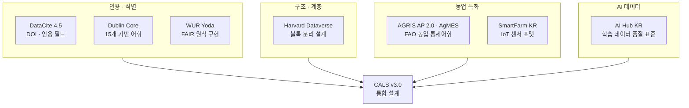
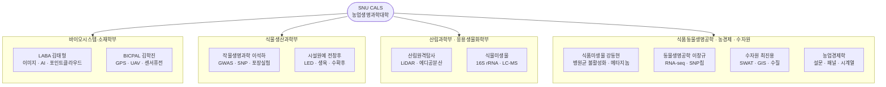
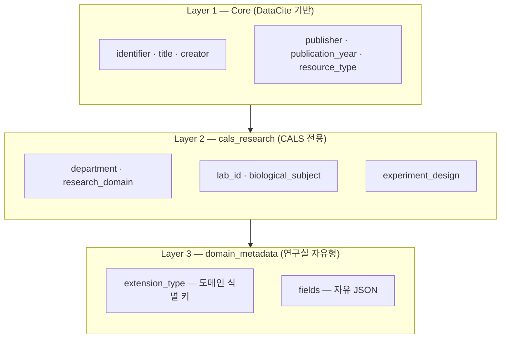
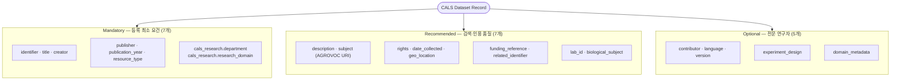
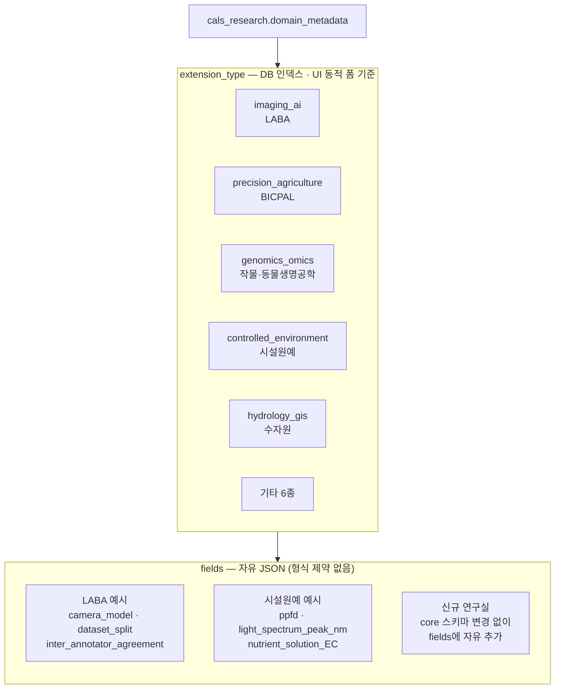

# CALS 데이터버스 메타데이터 표준 설계

> 발표일: 2026-02-25 | 서울대학교 농업생명과학대학

---

## 1. 국제 표준 조사

### 조사 대상: 7개 표준

### 표준별 기능 커버리지

| 기능 | DataCite | Harvard DV | Dublin Core | AGRIS | AI Hub | SmartFarm | WUR |
|------|:---:|:---:|:---:|:---:|:---:|:---:|:---:|
| DOI 부여 | ✅ | ✅ | ❌ | ❌ | ❌ | ❌ | ✅ |
| 농업 통제어휘 | ❌ | △ | ❌ | ✅ | △ | ✅ | △ |
| AI·이미지 지원 | △ | △ | ❌ | ❌ | ✅ | △ | ❌ |
| IoT 센서 | ❌ | ❌ | ❌ | ❌ | ❌ | ✅ | ❌ |
| 국제 상호운용 | ✅ | ✅ | ✅ | ✅ | ❌ | ❌ | ✅ |

> **결론**: 단일 표준으로 CALS 전체 커버 불가 → DataCite 80% 기반 + CALS 최소 확장 불가피

---

## 2. SNU CALS 연구 데이터 현황

### 10개 연구실 분포

### 데이터 유형 다양성

| 유형군 | 연구실 | 주요 데이터 형식 |
|--------|--------|----------------|
| AI · 센서 | LABA, BICPAL | 이미지·영상, GPS, LiDAR 포인트클라우드 |
| 생명과학 · 유전체 | 작물생명과학, 동물생명공학 | VCF, FASTQ, SNP 어레이 |
| 환경 · 시설 | 시설원예, 산림원격탐사 | 광질 스펙트럼, CO₂ 플럭스, 에디공분산 |
| 미생물 · 식품 | 식물미생물, 식품미생물 | 16S rRNA, LC-MS, 메타지놈 |
| 사회 · 수문 | 농업경제, 수자원 | 설문 패널, SWAT 수문 모형, GIS |

> **과제**: 5개 이질적 데이터 유형군을 단일 표준 체계로 통합 기술

---

## 3. 제안: CALS 메타데이터 스키마 v3.0

### 3-레이어 아키텍처

### MRO 필드 체계

### domain_metadata 자유형 확장

> - `extension_type` → DB GIN 인덱스 + UI 입력 폼 자동 생성 기준
> - `fields` 명세 참조: `standards/snu_cals_labs.json`
> - **신규 연구실 추가 시 core 스키마 수정 불필요**

### FAIR 원칙 구현

| FAIR | 구현 필드 |
|------|---------|
| **F**indable | `identifier` (DOI) · `subject` (AGROVOC URI) · `title` |
| **A**ccessible | `rights` · DataCite 국제 인덱싱 (OpenAIRE, BASE) |
| **I**nteroperable | DataCite 준수율 80% · AGROVOC 다국어 통제어휘 |
| **R**eusable | `experiment_design` · `biological_subject` · `domain_metadata.fields` |

### 핵심 지표

| 항목 | v3.0 |
|------|:---:|
| 전체 필드 수 | **44개** |
| 파일 크기 | **21 KB** |
| DataCite 준수율 | **~80%** |
| 필수 입력 필드 (M) | **7개** |
| 도메인 확장 구조 | **자유형 1블록** |
| 신규 연구실 추가 | **참조 파일만 수정** |

---

> **참조 파일**
> - `schema/cals_metadata_schema_v3.json` — 스키마 정의
> - `standards/snu_cals_labs.json` — 연구실별 domain_metadata.fields 명세
> - GitHub: https://github.com/colswap/cals-dataverse-metadata
