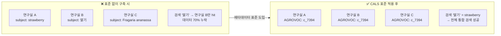
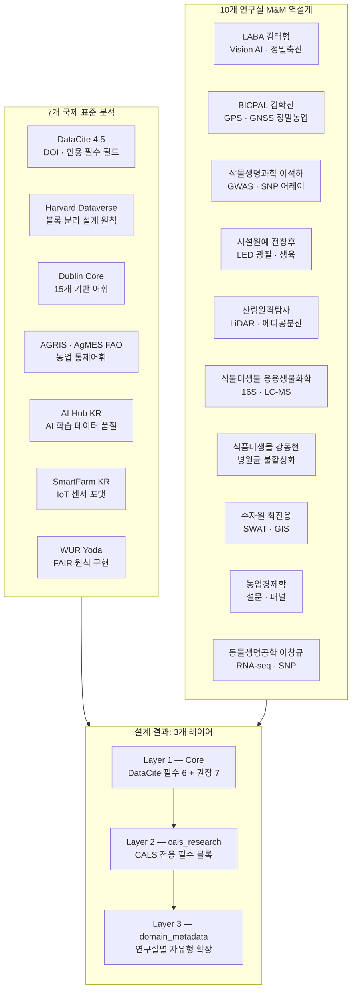
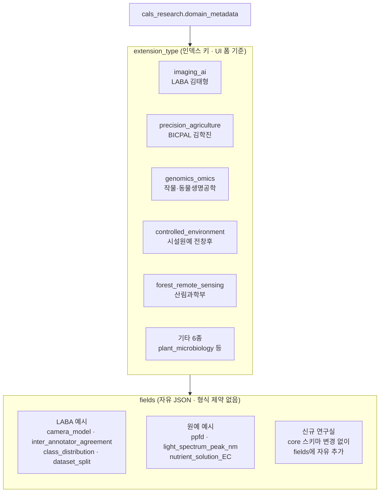
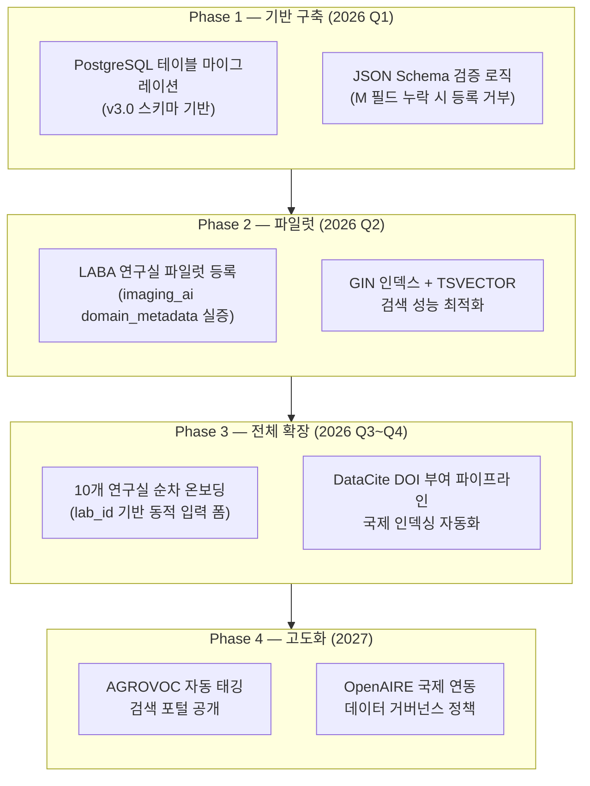

# CALS Dataverse 메타데이터 표준 설계 — 결정권자 요약 보고서

> 작성일: 2026-02-25 | 대상: 단과대 의사결정권자
> 참조 문서: `schema/cals_metadata_schema_v3.json` · `research/CALS_Schema_Critical_Review_v3.md`

---

## ⚠️ 현행 설계 진단 (3가지 핵심 리스크)

| 관점 | 현황 (v2.0) | 평가 |
|------|------------|------|
| **유지보수** | 333개 필드, 10개 강제 도메인 블록을 동시 관리 | 🔴 단과대 운영 인력으로 불가 |
| **입력 편의성** | 연구자가 등록 시 직면하는 필드 수: 30~50개 (도메인별) | 🔴 진입 장벽 → 데이터 미등록 위험 |
| **국제 정합성** | DataCite 준수율 ~40% | 🟡 국제 인덱싱 자동화 불가 |
| **현재 v3.0 방향** | 44개 필드, DataCite 80% 준수, 자유형 확장 | ✅ 운영 가능 수준 |

---

## 섹션 1: 데이터 구조 정의의 선행 필요성

### 핵심 명제: 비정형 데이터의 질서 있는 통합

### 메타데이터 선행 설계가 필요한 이유 (5줄 요약)

| 문제 | 표준 미적용 결과 | 표준 적용 후 |
|------|----------------|-------------|
| 동일 작물 다른 표기 | 검색 단절 | AGROVOC URI 정규화로 통합 |
| 실험 조건 미기록 | 재현 불가능 데이터 | experiment_design 블록 |
| 연구실 귀속 불명 | 데이터 출처 추적 불가 | lab_id + department 체계 |
| 국제 검색 불가 | 국내 고립 | DataCite DOI + 국제 인덱싱 |
| DB 구조 변경 비용 | 신규 연구실마다 전면 개편 | JSONB 자유형으로 무변경 확장 |

---

## 섹션 2: 글로벌 표준 및 CALS 역설계 요약

### 7개 국제 표준 → 3개 레이어 통합 설계

### 국제 표준 비교 — 어느 표준도 단독으로 CALS를 커버하지 못한다

| 기능 | DataCite | Harvard DV | Dublin Core | AGRIS | AI Hub | SmartFarm | WUR |
|------|:---:|:---:|:---:|:---:|:---:|:---:|:---:|
| DOI 부여 | ✅ | ✅ | ❌ | ❌ | ❌ | ❌ | ✅ |
| 농업 어휘 | ❌ | △ | ❌ | ✅ | △ | ✅ | △ |
| AI/이미지 지원 | △ | △ | ❌ | ❌ | ✅ | △ | ❌ |
| IoT 센서 | ❌ | ❌ | ❌ | ❌ | ❌ | ✅ | ❌ |
| 국제 상호운용 | ✅ | ✅ | ✅ | ✅ | ❌ | ❌ | ✅ |

> **결론**: 다표준 통합(Multi-Standard Integration) 불가피 → DataCite 80% 기반 + CALS 최소 확장

---

## 섹션 3: 통합 CALS 메타데이터 스키마 제안 (v3.0)

### 핵심 수치

| 항목 | v2.0 (과잉 설계) | v3.0 (최적화) | 변화 |
|------|:---:|:---:|:---:|
| 전체 필드 수 | 333개 | **44개** | -87% |
| 파일 크기 | 54 KB | **21 KB** | -61% |
| DataCite 준수율 | ~40% | **~80%** | +40%p |
| 도메인 확장 구조 | 10개 강제 블록 | **자유형 1블록** | 구조 전환 |
| 신규 연구실 추가 | core 스키마 수정 필요 | **참조 파일만 수정** | 분리 |

### MRO 필드 체계

```mermaid
flowchart TB
    ROOT(["CALS Dataset Record"])

    subgraph SG_M["Mandatory — 없으면 등록 불가 (7개)"]
        direction TB
        M1["identifier<br/>(DOI 또는 CALS-Internal)"]
        M2["title"]
        M3["creator (ORCID 권장)"]
        M4["publisher · publication_year · resource_type"]
        M5["cals_research.department<br/>cals_research.research_domain"]
    end

    subgraph SG_R["Recommended — 검색·인용 품질 직결 (7개)"]
        direction TB
        R1["description · subject + AGROVOC URI"]
        R2["rights · date_collected · geo_location"]
        R3["funding_reference · related_identifier"]
        R4["cals_research.lab_id<br/>cals_research.biological_subject"]
    end

    subgraph SG_O["Optional — 전문 연구자용 (5개)"]
        direction TB
        O1["contributor · language · version"]
        O2["cals_research.experiment_design"]
        O3["cals_research.domain_metadata<br/>(extension_type + fields 자유형)"]
    end

    ROOT --> SG_M
    ROOT --> SG_R
    ROOT --> SG_O
```

### domain_metadata 자유형 확장 — 핵심 설계 혁신

> **설계 원칙**: `extension_type`으로 도메인을 식별(DB 인덱스 + UI 동적 폼 기준)하고,
> `fields`는 `standards/snu_cals_labs.json`을 참조 명세서로 사용한다.
> core 스키마는 봉투(envelope)만 정의하므로, 신규 연구실 추가 시 core를 수정할 필요가 없다.

---

## 섹션 4: 설계 강점 및 적용 방안

### 장점

| # | 강점 | 근거 |
|---|------|------|
| 1 | **국제 즉시 인덱싱** | DataCite M 필드 준수 → OpenAIRE, BASE 자동 등록 |
| 2 | **등록 장벽 최소화** | M 필드 7개만 채워도 등록 완료. R/O는 이후 보완 가능 |
| 3 | **확장 비용 제로** | 신규 연구실 = `snu_cals_labs.json` 추가만으로 대응 |
| 4 | **FAIR 원칙 자동 준수** | DOI(F) · 접근권한(A) · AGROVOC(I) · M&M 재현 필드(R) |
| 5 | **Harvard Collection 호환** | `department`(1단계) + `lab_id`(2단계)로 계층 형성 |

### 적용 방안 (4단계 로드맵)

### 핵심 의사결정 포인트

- **지금 해야 할 것**: DB 구축 전 v3.0 스키마 확정 → 나중에 변경하면 마이그레이션 비용 폭증
- **하지 않아도 되는 것**: domain_metadata.fields 내부 구조를 미리 확정하지 않아도 됨 (자유형)
- **추천 파일럿 연구실**: LABA (김태형 교수) — AI 데이터로 가장 복잡한 케이스를 먼저 검증

---

> **참조 파일**
> - `schema/cals_metadata_schema_v3.json` — 최종 스키마
> - `standards/snu_cals_labs.json` — 연구실별 domain_metadata.fields 명세
> - `research/CALS_Schema_Critical_Review_v3.md` — 설계 비판 및 v2→v3 근거
> - `research/CALS_Dataverse_Strategy_Report.md` — 전체 상세 보고서
> - GitHub: https://github.com/colswap/cals-dataverse-metadata
